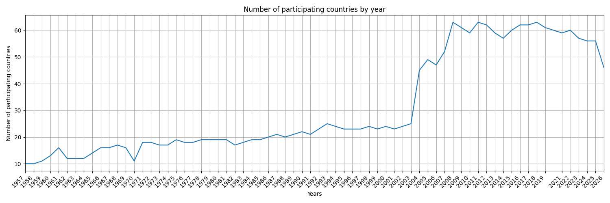
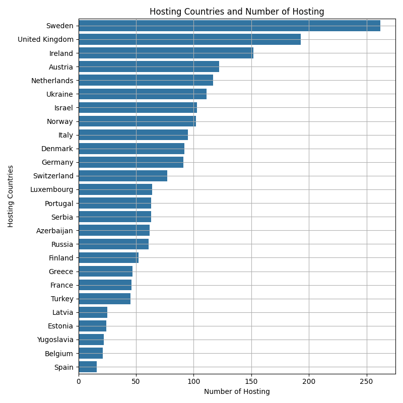
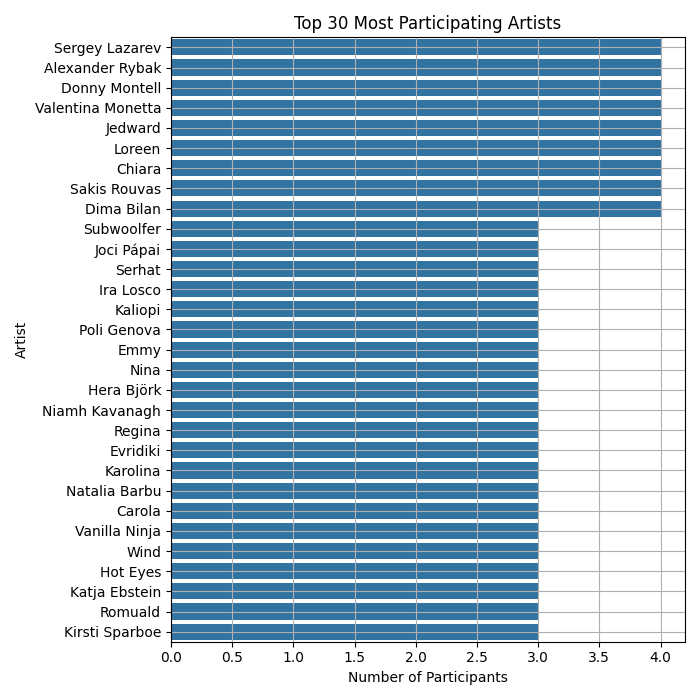
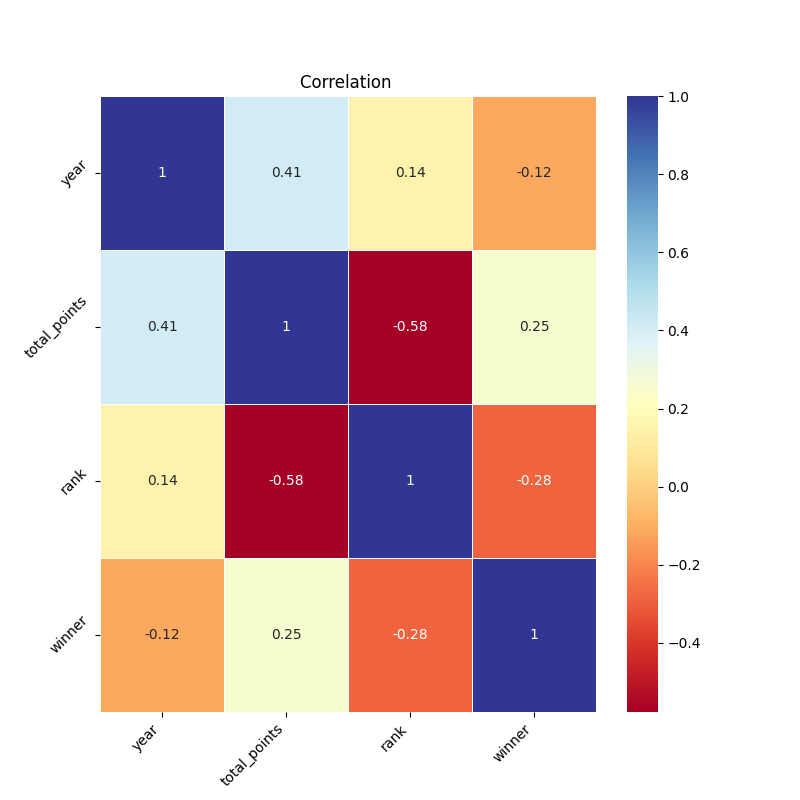
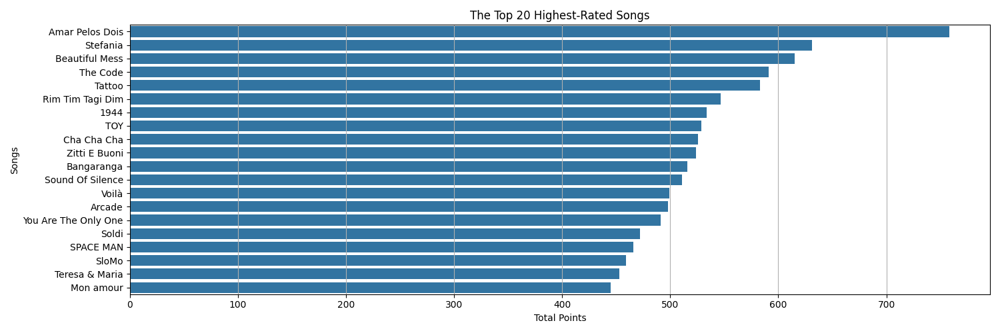
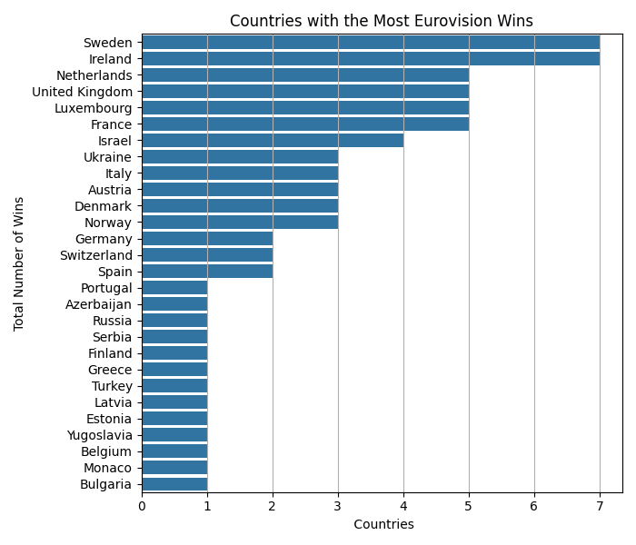
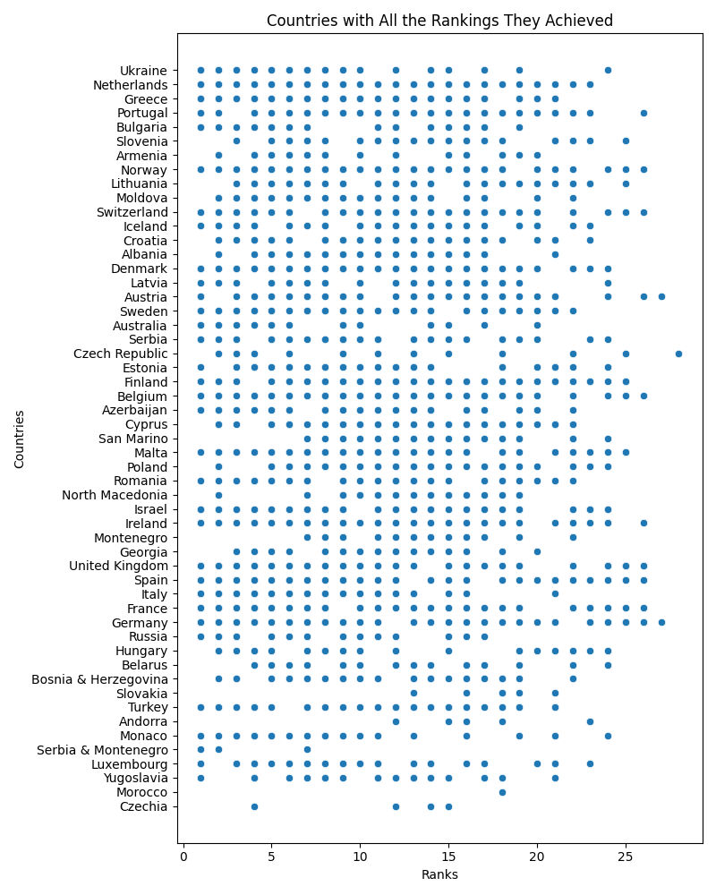
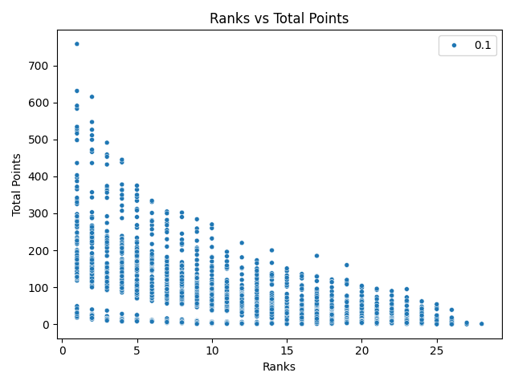

# 🎵 Eurovision Song Contest — Data Analysis & ML Pipeline
### `eurovision2026.csv` · Python · Pandas · Seaborn · Matplotlib · Scikit-learn

---

## Overview 

This project presents an **exploratory data analysis (EDA)** of the Eurovision Song Contest dataset, extended with a **machine learning rank prediction model**. The pipeline covers data ingestion, cleaning, the generation of nine distinct visualizations, and an interactive ML component that predicts a contestant's rank given a year and total point score.

The analysis is implemented in **Python 3**, leveraging industry-standard libraries for data manipulation, scientific visualization, and machine learning.

---

## Project Structure 

```
.
├── eurovision2026.csv          ← Source dataset
├── main.py                     ← Analysis & ML pipeline
└── images/
    ├── yearly_values_count.png
    ├── hosting_countries.png
    ├── top_30_most_participating_artists.png
    ├── correlation_heatmap.png
    ├── top_20_highest-rated_songs.png
    ├── countries_with_most_eurovision_wins.png
    ├── countries_with_sum_of_total_points_of_all_years.png
    ├── countries_with_all_ranks_analysis.png
    └── ranks_vs_total_points.png
```

---

## Dependencies

| Library        | Purpose                         |
|:---------------|:--------------------------------|
| `numpy`        | Numerical operations            |
| `pandas`       | Data loading & manipulation     |
| `matplotlib`   | Base plotting framework         |
| `seaborn`      | Statistical visualizations      |
| `scikit-learn` | Machine learning (rank prediction) |
| `os`           | Directory management            |

Install all dependencies via pip:

```bash
pip install numpy pandas matplotlib seaborn scikit-learn
```

---

## Usage

Place `eurovision2026.csv` in the project root, then run:

```bash
python main.py
```

All output images will be saved automatically to the `images/` directory. After the visualizations, the ML model will prompt you interactively for rank predictions.

---

## Pipeline Stages

### § 1 — Data Loading
```
load_data(path)
```
Reads the CSV file into a Pandas DataFrame using `pd.read_csv()`.

---

### § 2 — Data Inspection
```
inspect_data(df)
```
Prints structural diagnostics to stdout:
- `head` / `tail` previews
- `describe()` — descriptive statistics
- `info()` — column types and nullability
- `corr()` — numeric correlation matrix
- Duplicate and null value counts

---

### § 3 — Data Cleaning
```
cleaning_data(df)
```
Applies the following transformations:

| Operation | Details |
|:----------|:--------|
| Drop columns | `artist_url`, `running_order`, `image_url`, `event_url`, `country_emoji`, `rank_ordinal`, `qualified` |
| Drop null rows | Columns: `host_city`, `host_country`, `artist`, `song`, `artist_country`, `total_points`, `rank`, `winner` |
| Type casting | `total_points` → `int` · `rank` → `int` |

---

### § 4 — Analyses & Visualizations

```
┌─────┬────────────────────────────────────────────────────┬─────────────┐
│  #  │  Function                                          │  Chart Type │
├─────┼────────────────────────────────────────────────────┼─────────────┤
│  1  │  yearly_number_of_participants(df)                 │  Line       │
│  2  │  hosting_countries(df)                             │  Bar (H)    │
│  3  │  top_30_most_participating_artists(df)             │  Bar (H)    │
│  4  │  correlation_analysis(df)                          │  Heatmap    │
│  5  │  top_20_highest_rated_songs(df)                    │  Bar (H)    │
│  6  │  countries_with_most_eurovision_wins_analysis(df)  │  Bar (H)    │
│  7  │  countries_with_sum_of_total_points_...(df)        │  Bar (H)    │
│  8  │  countries_with_all_ranks_analysis(df)             │  Scatter    │
│  9  │  analysis_ranks_vs_total_points(df)                │  Scatter    │
└─────┴────────────────────────────────────────────────────┴─────────────┘
```

#### ① Yearly Number of Participants
Tracks how participation has grown or fluctuated across all contest editions using a time-series line plot.


#### ② Hosting Countries
Horizontal bar chart showing which countries have hosted the Eurovision Song Contest most frequently.


#### ③ Top 30 Most Participating Artists
Identifies recurring performers — artists who have appeared in the contest across multiple years.


#### ④ Correlation Heatmap
Computes Pearson correlations between all numeric features (`rank`, `total_points`, etc.) and renders them as an annotated `RdYlBu` heatmap.


#### ⑤ Top 20 Highest-Rated Songs
Ranks individual songs by `total_points` and visualizes the all-time top 20 scorers.


#### ⑥ Countries with Most Wins
Filters rows where `winner == True` and aggregates win counts by `artist_country`.


#### ⑦ Countries — Sum of Total Points
Groups by `artist_country` and sums `total_points` across all contest editions.


#### ⑧ Countries vs. All Rankings
Scatter plot mapping each country against every rank they have ever achieved, illustrating ranking variance over time.


#### ⑨ Rank vs. Total Points
Scatter plot revealing the relationship (and correlation strength) between a contestant's final rank and their total points earned.


---

### § 5 — ML Rank Prediction

```
predict_rank_from_year_and_total_point(df)
```

A **Linear Regression** model trained on the full cleaned dataset to predict a contestant's finishing rank based on two inputs: the contest year and the total points scored.

**Features:** `year`, `total_points`  
**Target:** `rank`  
**Model:** `sklearn.linear_model.LinearRegression`

#### How it works

```
1. Train the model on the entire cleaned dataset
2. Prompt the user to enter a year and total points
3. Output the predicted rank
4. Optionally repeat with different values
```

#### Example interaction

```
Enter a year: 2024
Enter a total point: 365
predicted rank: [3.17]

Do you wanna enter different values? (y/n): n
```

> **Note:** The model is trained on historical data and uses linear relationships between year, points, and rank. Predictions are approximations — Eurovision scoring systems and participant counts have changed over the decades, so results may vary for edge-case inputs.

---

## Dataset Columns

Columns retained after cleaning:

```
year · host_city · host_country · artist · song · artist_country
total_points · rank · winner
```

---

## Notes

- All plots are saved as `.png` files to `images/` before being displayed.
- The cleaning step operates on a **copy** of the original DataFrame (`df.copy()`), preserving raw data integrity.
- `plt.tight_layout()` is applied throughout to prevent label clipping in output images.
- The ML prediction function is recursive — entering `y` at the prompt re-runs it with new inputs.

---


## Author
***Elif Asya Tanrıvere***

Computer Engineering Student

*«The data doesn't lie — but it does sing.»*
